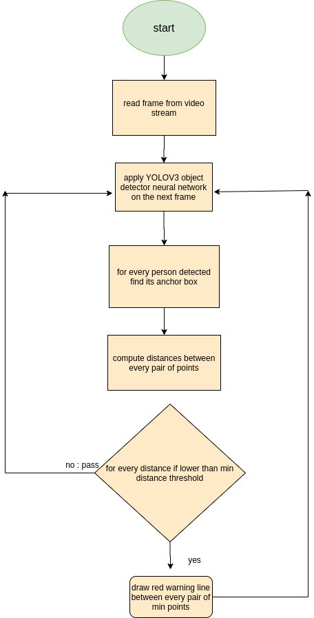

## AI Social Distancing Detector

In the fight against the coronavirus, social distancing has proven to be a very effective measure to slow down the spread of the disease. While millions of people are staying at home to help flatten the curve, many people in the manufacturing and pharmaceutical industries are still having to go to work everyday to make sure our basic needs are met.

To complement people's heroic efforts all around the world and to help ensure social distancing protocol in the workplace, an AI-enabled social distancing detection tool was developed that can detect if people are keeping a safe distance from each other by analyzing real time video streams from the camera.

For example, a factory that produces personal protective equipment, technicians could integrate this software into their security camera systems to monitor the working environment with easy calibration steps. As seen in demo below, the detector can highlight people whose distance is below the minimum acceptable distance in red, and draw a line between to emphasize this. The system will also be able to issue an alert to remind people to keep a safe distance if the protocol is violated.

source : https://landing.ai/landing-ai-creates-an-ai-tool-to-help-customers-monitor-social-distancing-in-the-workplace/ 

`check original results` 


this repo acts as open source python implementation 

## System Architecture




## Check sample result of the implementation


## Citation

test video taken from http://www.robots.ox.ac.uk/ActiveVision/Research/Projects/2009bbenfold_headpose/Datasets/TownCentreXVID.avi

``` 
@article{yolov3, 
  title={YOLOv3: An Incremental Improvement}, 
  author={Redmon, Joseph and Farhadi, Ali}, 
  journal = {arXiv}, 
  year={2018}
}
```

