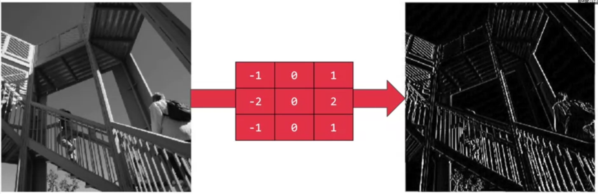
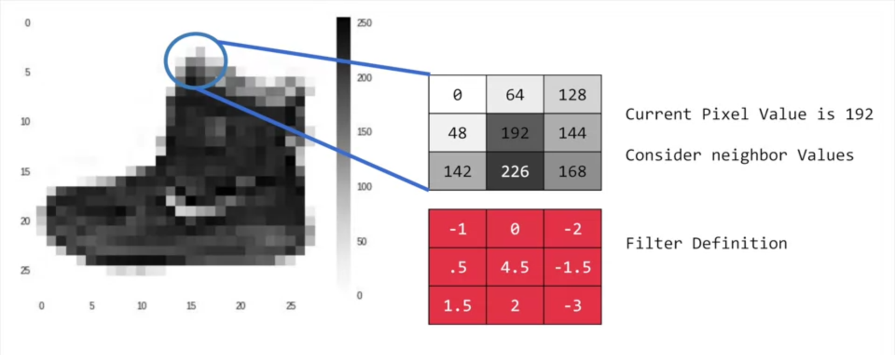
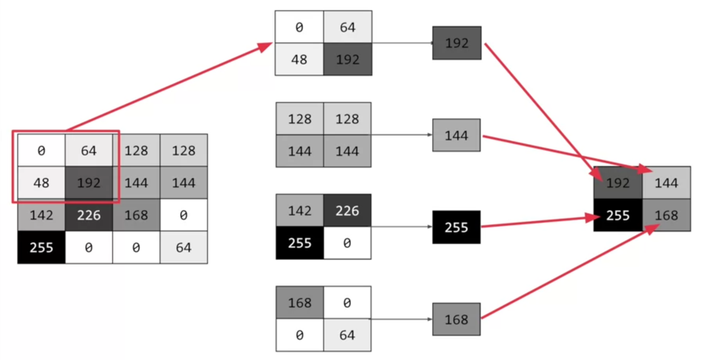

## Description
In the previous **_Computer Vision_** project, you made a DNN (Dense Neural Network) to detect digits **0 to 9** which were hand written. In this project we are going to make a classifier for the [Fashion MNIST](https://www.kaggle.com/zalando-research/fashionmnist) dataset. This dataset contains 70,000 images for 10 different fashion items, with an image size of `28 x 28`.

### The general approach for this would be to build a DNN using 3 layers:
* **_.Flatten()_ Layer**
* **Dense Layer**  (_Hidden_)
* **Dense Layer** (_Output_)

### Which looks something like this:
```Python
model = tf.keras.Sequential([
    tf.keras.layers.Flatten(),
    tf.keras.layers.Dense(128, activation='relu'),
    tf.keras.layers.Dense(10, activation='softmax')
])
```


## Drawback
Our model only works for _28 by 28_ images and that too if the images are centered with no other object present in the image, which is okay if you are doing this for the first time. But this can be easily optimised using **Convolutional Layers**

***

## Convolution and Pooling
* **Convolution:** In the most simple sense, convolutions are nothing but filters which are applied over your image to emphasize some features which are unique to the object.
Example: 

Or in the case of a shoe, the filter will emphasize certain features of it such as the sole or shoe laces.

Check this out to learn more about [Convolution](https://www.tensorflow.org/api_docs/python/tf/keras/layers/Conv2D).

* **Pooling:** Again, in the simplest of words, pooling is compressing the image to a smaller resolution than original, like in our case, a `28 x 28` image is compressed to a `13 x 13` image.

In the above image, we compressed a `4 x 4` matrix into a `2 x 2` using a pooling layer.
Check this out to learn more about [Pooling](https://www.tensorflow.org/api_docs/python/tf/keras/layers/MaxPool2D)
***
## Objective
To build a Convolutional Neural Network using the [Fashion MNIST](https://www.kaggle.com/zalando-research/fashionmnist) dataset.


To learn more about convolutions and how they work, check out this [playlist](https://bit.ly/2UGa7uH).

> Once you are done with your attempt of trying out the project, you can check the solution over [here](solution.ipynb).


## Credits
Material used in this project is from [Introduction to TensorFlow for Artificial Intelligence, Machine Learning, and Deep Learning](https://www.coursera.org/learn/introduction-tensorflow/home/welcome) from Coursera and hold all the rights for the same. This project is for educational purposes only.

