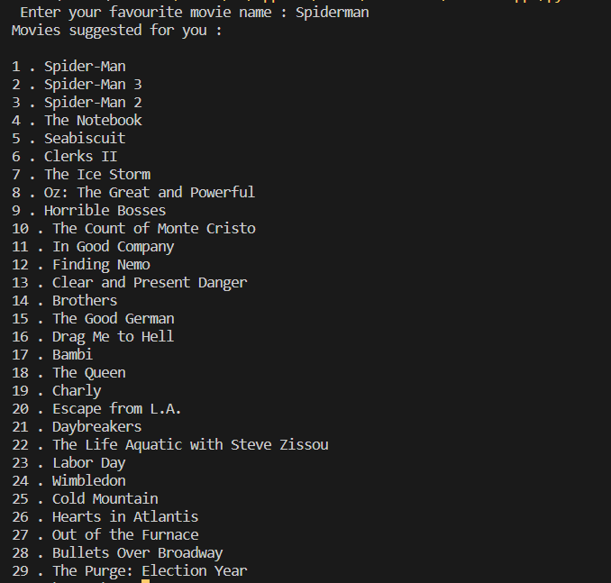

# Movie-Recommedation-System-using-Feature-Extraction

This is a movie recommendation system built using FEATURE EXTRACTION.

# HOW DOES IT WORK?

The technique used to build this recommendation system is <b>FEATURE EXTRACTION</b>, which basically means all the necessary features shall be seperated and saved in a variable. Using TfidfVectorizer() the feature vectors are extracted and the cosine similarity is used to find the similarity between the user's search and these vectors. 

# WORKFLOW OF THE PROJECT

# OUTPUT 

Link to the tutorial for this project is : https://www.youtube.com/watch?v=7rEagFH9tQg&t=1097s
